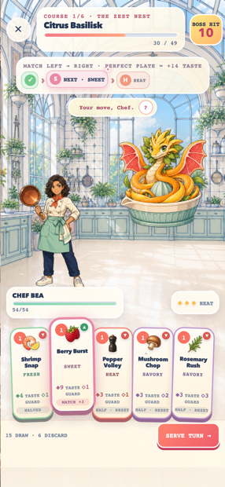

# Whisk & Fury: Recipe Rumble




A portrait 2D culinary roguelike for RUN.world. Chef Bea battles living recipes and rival chefs by throwing ingredient cards in the flavor order shown above each enemy. Correct sequences trigger a Perfect Plate combo — and chained plates pay escalating Taste — until the monster transforms into the finished dish.

Each run is a six-course service with branching "choose your next course" decisions between fights. Technique cards (a wildcard whisk, a 0-cost knife cantrip, a pattern-burning copper sear) join the seventeen ingredients; rewards can be taken, skipped for healing, or traded for deck thinning. Late-course monsters fight back with signature mechanics — eruptions on a slipped sequence, reshuffled recipes, veiled flavors, caramel armor, a phoenix revive, and a two-phase rival chef. Runs persist to app storage and resume from the menu; defeated monsters fill a collection cookbook, and cookbook stars unlock alternate starting decks.

Every card shows what it will actually do this turn rather than its base stat: a green ▲ and the boosted Taste when it matches the glowing flavor, a gold ★ when it completes the pattern, a red ▼ and the halved value when it does not. Guard flies from the card into the status bar, and the boss badge subtracts it for you.

## Stack

- React 19 shell and PixiJS 8 combat scene
- WebGPU-first renderer with WebGL fallback
- TypeScript, Vite 6, RUN SDK 5.24
- Hand-painted generated character art with locally processed alpha sprites
- Looping licensed music bed with a layered procedural SFX and haptics map ([`docs/audio.md`](./docs/audio.md))

## Local development

```sh
npm install --cache /tmp/whisk-and-fury-npm-cache
npm run dev
npm run check
```

Host-dependent storage, ads, purchases, profiles, and entitlements must be verified with `npm run dev:playground`. Purchases in the playground are real and persistent; do not initiate them without owner approval.

Design and production notes live in [`docs/`](./docs/).
